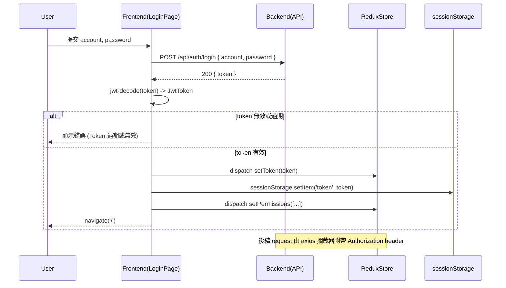

# 登入流程總覽

此文件說明本專案的前端登入（Authentication）流程，方便開發者與維護者快速理解相關程式檔案、資料流、Token 處理與排錯要點。

> 假設與註記
>
> - 本檔放在 `Documents/login/README.md`（專案內已有 `Documents/` 資料夾，因此採用單數 `Document` 的使用者要求時，做了合理推斷）。
>

## 主要目的

- 說明登入的端到端流程（表單 -> API -> jwt 解析 -> 權限儲存 -> 導頁）
- 列出主要相關檔案與其職責
- 說明 API 契約、Token 儲存位置與注意事項
- 提供測試/排錯與維護建議

## 快速流程（高階步驟）

1. 使用者在登入頁輸入 `account` 跟 `password`，按下「登入」。
2. 前端呼叫 `api/users.ts` 中的 `login`，送出 POST 到 `api/auth/login`。
3. 後端回傳的資料契約為 `{ token: string }`（JWT）。
4. 前端使用 `jwt-decode` 與專案內 `JwtToken` 類別解析 payload（前端僅解析，不驗證簽章）。
5. 檢查 token 是否過期；若有效，將原始 token dispatch 到 Redux (`authSlice`) 並同時儲存在 `sessionStorage`。
6. 從 JWT payload 取出 `permissions`（若存在），過濾為專案內定義的允許權限集合，dispatch 到 Redux。
7. 導向應用首頁（`navigate('/', { replace: true })`）。

## 順序圖（Sequence Diagram）

以下為登入流程的 mermaid 順序圖，幫助快速理解各個元件間的互動：

## 重要檔案清單（路徑與說明）

- `src/pages/login/index.tsx`
  - 登入表單 UI、提交處理邏輯、token 解析與初始權限處理。
  - 會呼叫 `login(values)` 取得 `{ token }`，解析後放到 Redux 與 `sessionStorage`。

- `src/api/users.ts`
  - 封裝與登入相關的 API 呼叫：`login(data)` 與 `getUserPermissions()`。
  - `login` 會回傳 `res.data`，其中須包含 `token: string`。

- `src/store/login/authSlice.ts`
  - 管理 `token` 與 `permissions` 的 Redux slice。
  - 初始會從 `sessionStorage.getItem('token')` 讀取 token（支援頁面重新整理後自動恢復）。
  - 提供 `setToken`, `clearToken`, `setPermissions`, `clearPermissions`。

- `src/utils/http/http.ts`
  - axios 實例、攔截器、錯誤處理與 retry 機制。
  - Request 攔截器會嘗試從 Redux store 取得 `authSlice.token`，若存在會加上 `Authorization: Bearer <token>`。
  - Response 攔截器會處理非 2xx 的 business/error 情況，並在 401 時嘗試登出並導向 `/login`。

- `src/utils/http/request.ts`
  - 封裝 `get`、`post` 等簡易函式，回傳型別為 `ApiResponse<T>`。

- `src/types/jwtPayload.ts` (專案中 `JwtToken` 類別，用於解析 payload 與檢查過期)
  - 前端使用該工具類別來判斷 token 是否過期與取出 sub / permissions 等欄位。

## API 契約（目前專案內使用的契約）

- POST `api/auth/login`
  - Request body: `{ account: string, password: string }`
  - Response data: `{ token: string }`（前端預期 `token` 為 JWT 字串）

- GET `/permissions`（若後端支援）
  - Response data: `string[]` 或 `Permission[]`（專案中 `getUserPermissions()` 的回傳型別為 `Permission[]`）。

## Token 與權限處理細節

- 前端會將原始 JWT 字串：
  - dispatch 到 Redux：`authSlice.setToken(token)`（同時此 action 也會把 token 寫入 `sessionStorage`）
  - 直接寫入 `sessionStorage.setItem('token', token)`（登入流程中同時做一次寫入）
- 使用 `jwt-decode` 與 `JwtToken` 解析 payload（注意：僅解析 payload，不做簽章驗證）
- 權限處理：登入頁會從 payload 取 `permissions`（若有），過濾只保留與 `src/constants/permissions.ts` 中定義相符的權限字串，然後 dispatch `setPermissions`（型別為 `Permission[]`）。
- axios 攔截器會在每次 request 自動（若可取得）加上 `Authorization: Bearer <token>`，因此後續 API 不需額外每次手動加 header。
- 登出時應呼叫 `authSlice.clearToken()` 並同時清空 `sessionStorage` 中的 token 與 account（slice 中已處理 token 清除，頁面可額外清除 account）。

## 錯誤處理與 UX 行為

- 若登入 API 回傳沒有 `token` 或 token 非字串，畫面會顯示錯誤訊息（`message.error('登入失敗，未取得 token')`）。
- 若 token 已過期（解析判定），會顯示錯誤訊息並中止登入。
- axios response 攔截器對不同錯誤（network / timeout / 401 / 403 / 5xx / business error）會做分類，並用 AntD `message` 顯示合適提示。
- 401 在攔截器中會觸發 redirect 回 `/login` 並嘗試 dispatch logout（請注意：目前攔截器內的 store.dispatch 的 action 名稱為 `auth/logout`，與 `authSlice` 的 action 名稱 `clearToken` 不同，需留意整合一致性）。

## 本地測試 / QA 指南

- 啟動開發伺服器（參考專案 `package.json` 中的 script，通常為 `npm run dev` 或 `yarn dev`）。
- 開啟瀏覽器到 `/login`，輸入測試帳密並送出。
- 在開發者工具 (Console / Network)：
  - 檢查 POST `api/auth/login` 的 request body 是否為 `{ account, password }`。
  - 檢查 response 是否包含 `token`。
  - 檢查 `sessionStorage` 是否有寫入 `token` 與 `account`。
  - 檢查 Redux `auth` state（或在 `store.getState()`）是否有更新 `token` 與 `permissions`。
- 測試 401/403 路徑：嘗試把 token 設成過期或刪除，呼叫需要授權的 API，確認攔截器是否導向 `/login` 並顯示對應提示。

## 常見問題與排錯建議

- "登入後沒有導向首頁":
  - 檢查 `handleSubmit` 中 `navigate('/', { replace: true })` 是否有執行。
  - 檢查 token 是否為空或被視為過期。

- "API 請求沒有帶 Authorization header":
  - 檢查 `store` 中 `authSlice.token` 是否存在（攔截器會從 store 讀取）。
  - 確認攔截器使用 `config.headers.set('Authorization', ...)` 的方式能在 target axios 版本與 TypeScript 設定下正確執行（注意：某些情況下應改用 `config.headers = config.headers || {}; config.headers['Authorization'] = ...`）。

- "登出但 token 仍存在":
  - 確認是否有呼叫 `clearToken()` 或手動移除 `sessionStorage.removeItem('token')`。

## 建議改進（短期 / 中期）

- 將攔截器中觸發 logout 的 action 與 `authSlice` 的 action 名稱統一，避免 store.dispatch 找不到 action 的情況。
- 將 `sessionStorage` 的 key（如 `token`, `account`）抽成常數，避免 magic strings。
- 在 `http` 的 request 攔截器中，改用兼容的 header 賦值方式（看環境與 axios 型別），以避免 `config.headers.set` 在某些 TS 設定下出錯。
- 增加單元測試或整合測試覆蓋：
  - 登入成功路徑（回傳 token -> token 被寫入 Redux 與 sessionStorage）
  - token 過期路徑
  - 401 攔截器導向

## 參考檔案

- `src/pages/login/index.tsx`
- `src/api/users.ts`
- `src/store/login/authSlice.ts`
- `src/utils/http/http.ts`
- `src/utils/http/request.ts`
- `src/types/jwtPayload.ts`
- `src/constants/permissions.ts`

---

若需要，我可以把上面提到的改進（如修正攔截器 header 賦值、統一 logout action）實作於 `src/utils/http/http.ts` 與 `src/store/login/authSlice.ts`，並順便新增一個小測試。請告訴我是否要繼續。
